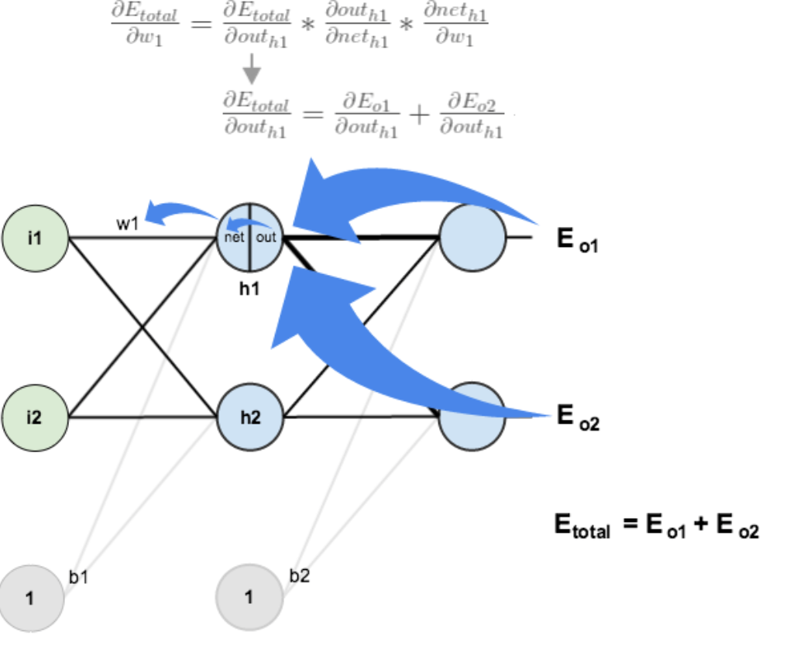
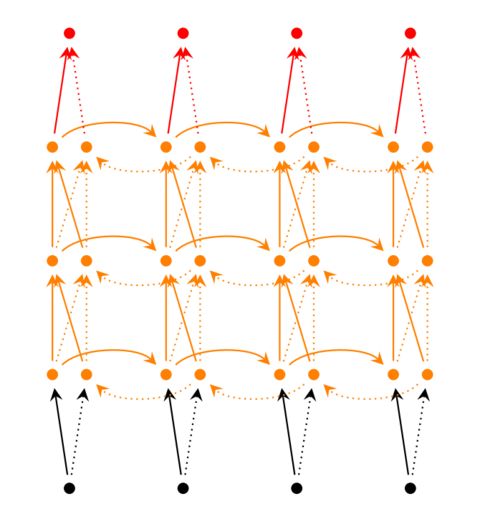

# 深度学习

## 基础概念

### 神经元
> 神经元(Neuron)形成神经网络的基本结构。在神经网络中，神经元接收输入，处理并产生输出，而这个输出被发送到其他神经元用于进一步处理，或者作为最终输出进行输出。

### 权重
> 当输入进入神经元时，它会乘以一个权重(Weights)。

### 偏差
> 除了权重之外，还有一个被应用于输入的线性分量，称为偏差(bias),它被加到权重与输入相乘的结果中。添加偏差后，如果输入为a，与其相关联的权重为w，那么结果看起来a*w+偏差，这是输入变换的最终线性分量。

### 激活函数
> 激活函数(Activation Function)将输入信号转换为输出信号，应用激活函数后结果变为f(a*w+b)，f就是激活函数。
> 常见的激活函数有：
> 1.Sigmoid：$sigmoid(x)=\frac{1}{1+e^{-x}}$
> Sigmoid的一个缺点是它的导数值很小，其导数最大值只有1/4，在输入很大或很小的时候其导数趋近于0，这会导致反向传播中梯度会衰减的十分迅速，导致传递到前边层的梯度很小甚至消失，使训练会变得十分困难。
> 2.ReLU：$f(x)=max(x,0)$
> 3.Softmax:$$f(z_j)=\frac{e^{z_j}}{\sum^n_{i=1}e^{z_i}}$$
> Softmax激活函数通常用于输出层，用于分类问题。它与sigmoid函数是很类似的，唯一的区别就是输出被归一化为总和为1。Sigmoid函数将发挥作用以防我们有一个二进制输出，但是如果我们有一个多类分类问题，softmax函数使为每个类分配值这种操作变得相当简单，而这可以将其解释为概率。
> 4.TanH：$$tanh(x)=\frac{sinhx}{coshx}=\frac{e^x-e^{-x}}{e^x+e^{-x}}$$

### 神经网络
> 神经网络(Neural Network)的目标是找到一个未知函数的近似值，它由相互联系的神经元组成，这些神经元具有权重，并在网络训练期间根据错误来进行更新，激活的神经元的组合会给出输出值。

### 输入/输出/隐藏层
> 输入层(Input Layer)是接收输入那一层，本质上是网络的第一层。输出层(Output Layer)是生成输出的那一层，也可以说是网络的最终层。隐藏层(Hidden Layer)对传入数据执行特定任务并将其生成的输出传递到下一层。

### 多层感知器(MLP)
> 单个神经元无法执行高度复杂的任务。因此，使用堆栈的神经元来生成我们所需要的输出。在最简单的网络中，有一个输入层、一个隐藏层和一个输出层,每个层都有多个神经元，并且每个层中的所有神经元都连接到下一层的所有神经元。这些网络也可以被称为完全连接的网络。

### 正向传播
> 正向传播(Forward Propagation)是指输入通过隐藏层到输出层的运动，信息沿着单一方向前进，输入层将输入提供给隐藏层，然后生成输出。

### 成本函数
> 成本/损失函数(Cost Function)用来衡量网络的准确性，最优化的输出是使损失函数最小的输出，神经网络的学习过程围绕最小化损失函数进行。
> 若将成本函数定义为均方误差，则可写为$C=\frac{1}{m}\sum(y-a)^2$，其中m是训练样本的数量，a是预测值，y是实际值。

### 梯度下降
> 梯度下降(Gradient Descent)是一种最小化成本的优化算法，比如从一个点x开始，每次向下移动一点Δh，并将位置更新为x-Δh，直到达到最优解。

### 学习率
> 学习率(Learning Rate)被定义为每次迭代中成本函数最小化的量，即下降到成本函数最优解的速率是学习率。

### 反向传播
> 反向传播(Backpropagation)是将误差从后向前传播，更新网络权值参数的过程。
> 接下来以一个具体的例子说明反向传播的过程：
> 现在使用一个包含一个输入层、一个隐藏层和一个输出层的的神经网络。输入层包含两个神经元i1，i2和偏置项b1；隐藏层包含两个神经元h1，h2和偏置项b2；输出层包含两个神经元o1和o2.wi是层与层之间的权重，激活函数这里使用sigmoid函数。简单的赋上初值后如下所示：


> 第一步 前向传播
> 1.输入层->隐藏层
> $net_{h1}=w_1*i_1+w_2*i_2+b_1$
> $out_{h1}=\frac{1}{1+e^{-net_{h1}}}$
> h2的计算方法同理
> 2.隐藏层->输出层
> $net_{o1}=w_5*out_{h1}+w_6*out_{h2}+b_2$
> $out_{o1}=\frac{1}{1+e^{-net_{o1}}}$
> 通过上述步骤，得到输出值为[0.7513,0.7729],这与实际值[0.01,0.99]相差还很远，接下来对误差进行反向传播，更新权值，重新计算输出。

> 第二步 反向传播
> 1.计算总误差
> 总误差(square error):
> $E_{total}=\sum\frac{1}{2}(target-output)^2$
> 再分别计算o1和o2的误差，总误差为两者之和：
> $E_{o1}=\frac{1}{2}(target_{o1}-output_{o1})^2$
> $E_{o2}=\frac{1}{2}(target_{o2}-output_{o2})^2$
> $E_{total}=E_{o1}+E_{o2}$
> 2.隐藏层->输出层的权值更新
> 以更新权值w5为里，我们希望知道w5对整体误差产生了多少影响，可以用整体误差对w5求偏导求出：(链式法则)
> $$\frac{\partial{E_{total}}}{\partial{w_5}}
> =\frac{\partial{E_{total}}}{\partial{out_{o1}}}*
> \frac{\partial{out_{o1}}}{\partial{net_{o1}}}*
>\frac{\partial{net_{o1}}}{\partial{w_5}}$$


> 接下来分别计算每个式子的值：
> $E_{total}=\frac{1}{2}(target_{o1}-out_{o1})^2+\frac{1}{2}(target_{o2}-out_{o2})^2$
> $\frac{\partial{E_{total}}}{\partial{out_{o1}}}=-(target_{o1}-out_{o1})$
> $out_{o1}=\frac{1}{1+e^{-net_{o1}}}$
> $\frac{\partial{out_{o1}}}{\partial{net_{o1}}}=out_{o1}(1-out_{o1})$
> $net_{o1}=w_5*out_{h1}+w_6*out_{h2}+b_2$
> $\frac{\partial{net_{o1}}}{\partial{w_5}}=out_{h1}$
于是可得$\frac{\partial{E_{total}}}{\partial{w_5}}=-(target_{o1}-out_{o1})*out_{o1}*(1-out_{o1})*out_{h1}$
通过计算更新w5的值，α是梯度下降的学习速率，这里取0.5：
$w_5^+=w_5-α*\frac{\partial{E_{toal}}}{\partial{w_5}}
=0.4-0.5*0.082=0.359$

> 3.隐藏层->隐藏层的权值更新
> 方法与上面说的差不多，依然采用链式法则，但是有一个地方需要变一下，第2步计算对w5的偏导时，是从out(o1)->net(o1)->w5，但是在隐藏层之间的权值更新时，是out(h1)->net(h1)->w1,而out(h1)会接受E(o1)和E(o2)两个地方传来的误差，所以这里两个都要算。
> 

```python
#一个具体的三层神经网络进行正向传播和反向传播的例子
#coding:utf-8
import random
import math

#
#参数解释：
#"PD_":偏导的前缀
#"D_":导数的前缀
#"w_ho":隐藏层到输出层的权重系数索引
#"w_ih":输入层到隐藏层的权重系数索引

class NeuralNetwork:    #简单三层神经网络类
    LearningRate=0.5    #梯度下降的学习速率

    def __init__(self,InputNum,HiddenNum,OutputNum,HiddenLayerWights=None,
                 HiddenLayerBias=None,OutputLayerWeights=None,OutputLayerBias=None):
        self.InputNum=InputNum      #输入层神经元数目
        self.HiddenLayer=NeuronLayer(HiddenNum,HiddenLayerBias)
        self.OutputLayer=NeuronLayer(OutputNum,OutputLayerBias)

        self.InitWeighsFromInputsToHiddenLayer(HiddenLayerWights)
        self.InitWeightsFromHiddenLayerToOutput(OutputLayerWeights)

     #初始化输入层到隐藏层的权值矩阵
    def InitWeighsFromInputsToHiddenLayer(self,HiddenLayerWeights):
        WeightNum=0
        for i in range(len(self.HiddenLayer.neurons)):
            for j in range(self.InputNum):
                if not HiddenLayerWeights:
                    self.HiddenLayer.neurons[i].weights.append(random.random())
                else:
                    self.HiddenLayer.neurons[i].weights.append(HiddenLayerWeights[WeightNum])
                WeightNum+=1

    #初始化隐藏层到输出层的权值矩阵
    def InitWeightsFromHiddenLayerToOutput(self,OutputLayerWeights):
        WeightNum=0
        for i in range(len(self.OutputLayer.neurons)):
            for j in range(len(self.HiddenLayer.neurons)):
                if not OutputLayerWeights:
                    self.OutputLayer.neurons[i].weights.append(random.random())
                else:
                    self.OutputLayer.neurons[i].weights.append(OutputLayerWeights[WeightNum])
                WeightNum+=1

    #检查神经网络
    def inspect(self):
        print('------')
        print('* Inputs:{}'.format(self.InputNum))
        print('------')
        print('Hiddern Layer')
        self.HiddenLayer.inspect()
        print('------')
        print('* Output Layer')
        self.OutputLayer.inspect()
        print('------')

    #前向传播
    def FeedForward(self,inputs):
        HiddenLayerOutput=self.HiddenLayer.FeedForward(inputs)
        return self.OutputLayer.FeedForward(HiddenLayerOutput)  #返回输出层的值

    #训练神经网络
    def Train(self,TrainingInputs,TrainingOutputs):
        self.FeedForward(TrainingInputs)    #前向传播
        # 1.总误差对输出层神经元净输入的偏导
        PD_ErrorToNetin=[0]*len(self.OutputLayer.neurons)
        for i in range(len(self.OutputLayer.neurons)):
            PD_ErrorToNetin[i]=self.OutputLayer.neurons[i].CalculatePD_ErrorToNetin(TrainingOutputs[i])
        # 2.总误差对隐藏层神经元净输入的偏导
        PD_ErrorToHiddenin=[0]*len(self.HiddenLayer.neurons)
        for i in range(len(self.HiddenLayer.neurons)):
            # dE/dyⱼ = Σ ∂E/∂zⱼ * ∂z/∂yⱼ = Σ ∂E/∂zⱼ * wᵢⱼ
            D_ErrorToHiddenout=0
            for j in range(len(self.OutputLayer.neurons)):
                D_ErrorToHiddenout+=PD_ErrorToNetin[j]*self.OutputLayer.neurons[j].weights[i]
            # ∂E/∂zⱼ = dE/dyⱼ * ∂zⱼ/∂
            PD_ErrorToHiddenin[i]=D_ErrorToHiddenout*self.HiddenLayer.neurons[i].CalculatePD_NetoutToNetin()
        # 3.更新输出层权值系数
        for i in range(len(self.OutputLayer.neurons)):
            for w_ho in range(len(self.OutputLayer.neurons[i].weights)):
                # ∂Eⱼ/∂wᵢⱼ = ∂E/∂zⱼ * ∂zⱼ/∂wᵢⱼ
                PD_ErrorToWeight=PD_ErrorToNetin[i]*self.OutputLayer.neurons[i].CalculatePD_NetinToWeight(w_ho)
                # Δw = α * ∂Eⱼ/∂wᵢ
                self.OutputLayer.neurons[i].weights[w_ho]-=self.LearningRate*PD_ErrorToWeight
        # 4.更新隐藏层的权值系数
        for i in range(len(self.HiddenLayer.neurons)):
            for w_ih in range(len(self.HiddenLayer.neurons[i].weights)):
                # ∂Eⱼ/∂wᵢ = ∂E/∂zⱼ * ∂zⱼ/∂wᵢ
                PD_ErrorToWeight=PD_ErrorToHiddenin[i]*self.HiddenLayer.neurons[i].CalculatePD_NetinToWeight(w_ih)
                # Δw = α * ∂Eⱼ/∂wᵢ
                self.HiddenLayer.neurons[i].weights[w_ih]-=self.LearningRate*PD_ErrorToWeight
    #计算总误差
    def CalculateToalError(self,TrainingSets):
        TotalError=0
        for i in range(len(TrainingSets)):
            TrainingInput,TrainingOutput=TrainingSets[i]
            self.FeedForward(TrainingInput)
            for j in range(len(TrainingOutput)):
                TotalError+=self.OutputLayer.neurons[j].CalculateError(TrainingOutput[j])
        return TotalError


class NeuronLayer:     #神经网络层
    def __init__(self,NeuronsNum,bias):
        self.bias=bias if bias else random.random()  #同一层的神经元共享一个偏置项
        self.neurons=[]    #神经网络层的神经元
        for i in range(NeuronsNum):
            self.neurons.append(Neuron(self.bias))

    #检查该层神经元
    def inspect(self):
        print('Neurons:',len(self.neurons))  #打印神经元数目
        for n in range(len(self.neurons)):  #打印权值及偏置项
            print(" Neuron",n)
            for w in range(len(self.neurons[n].weights)):
                print(" Weight:",self.neurons[n].weights[w])
            print(" Bias:",self.bias)

    #对本层的神经元进行前向传播
    def FeedForward(self,inputs):
        outputs=[]
        for neuron in self.neurons:
            outputs.append(neuron.CalculateOutputs(inputs))
        return outputs

    #获取输出值
    def GetOutputs(self):
        outputs=[]
        for neuron in self.neurons:
            outputs.append(neuron.output)
        return outputs


class Neuron:
    def __init__(self,bias):
        self.bias=bias     #偏置项
        self.weights=[]   #权值

    #计算该神经元的输出
    def CalculateOutputs(self,inputs):
        self.inputs=inputs
        self.output=self.ActivationSigmoid(self.CalculateTotalInput())
        return self.output

    #计算该神经元的总输入
    def CalculateTotalInput(self):
        total=0
        for i in range(len(self.inputs)):
            total+=self.inputs[i]*self.weights[i]
        return total+self.bias

    #定义sigmoid激活函数
    def ActivationSigmoid(self,TotalNetInput):
        return 1/(1+math.exp(-TotalNetInput))

    #计算总误差对输出层的总输入值的偏导
    def CalculatePD_ErrorToNetin(self,TargetOutput):
        return self.CalculatePD_ErrorToNetout(TargetOutput)*self.CalculatePD_NetoutToNetin()

    #计算每个神经元的误差，由平方差公式计算得到
    def CalculateError(self,TargetOutput):
        return 0.5*((TargetOutput-self.output)**2)

    #计算总误差对输出层输出值的偏导
    def CalculatePD_ErrorToNetout(self,TargetOutput):
        return -(TargetOutput-self.output)

    #计算激活函数的偏导
    def CalculatePD_NetoutToNetin(self):
        return self.output*(1-self.output)

    #计算神经元的总输入对某个权值的偏导
    def CalculatePD_NetinToWeight(self,index):
        return self.inputs[index]

#for example
nn=NeuralNetwork(2,2,2,HiddenLayerWights=[0.15,0.2,0.25,0.3],HiddenLayerBias=0.35,
                 OutputLayerWeights=[0.4,0.45,0.5,0.55],OutputLayerBias=0.6)
for i in range(10000):
    nn.Train([0.05,0.1],[0.01,0.09])
    print(i,round(nn.CalculateToalError([[[0.05,0.1],[0.01,0.09]]]),9))  #round函数用来四舍五入

#另外一个例子，可以把上面的例子注释掉再运行一下:
# training_sets = [
#     [[0, 0], [0]],
#     [[0, 1], [1]],
#     [[1, 0], [1]],
#     [[1, 1], [0]]
# ]
# nn = NeuralNetwork(len(training_sets[0][0]), 5, len(training_sets[0][1]))
# for i in range(10000):
#     training_inputs, training_outputs = random.choice(training_sets)
#     nn.Train(training_inputs, training_outputs)
#     print(i, nn.CalculateToalError(training_sets))
```

##RNN
> RNN(Recurrent Neural Network)是一类用于处理序列数据的神经网络。时间序列数据是指在不同时间点上收集到的数据，这类数据反映了某一事物、现象等随时间的变化状态或程度。当然序列数据可以不只是时间序列，比如文字序列，但总归序列数据有一个特点--后面的数据跟前面的数据有关系。

> 全连接神经网络和卷积神经网络他们都只能单独的取处理一个个的输入，前一个输入和后一个输入是完全没有关系的。但是，某些任务需要能够更好的处理序列的信息，即前面的输入和后面的输入是有关系的。比如，当我们在理解一句话意思时，孤立的理解这句话的每个词是不够的，我们需要处理这些词连接起来的整个序列；当我们处理视频的时候，我们也不能只单独的去分析每一帧，而要分析这些帧连接起来的整个序列。这时，就需要用到深度学习领域中另一类非常重要神经网络：循环神经网络(Recurrent Neural Network)。一个简单的RNN如下图所示，由输入层、一个隐藏层和一个输出层组成：


> x是一个向量，它表示输入层的值；s是一个向量，它表示隐藏层的值；o也是一个向量，它表示输出层的值。U是输入层到隐藏层的权值矩阵，V是隐藏层到输出层的权值矩阵，权值矩阵W是隐藏层上一次的值作为这一次的输入的权值。

> RNN在t时刻接收到输入$x_t$之后，隐藏层的值是$s_t$，输出值是$o_t$。$s_t$的值不仅仅取决于$x_t$，还取决于$s_{t-1}$。用以下公式表示RNN的计算方法：
> $(1)o_t=g(Vs_t)$
> $(2)s_t=f(Ux_t+Ws_{t-1})$
> 式(1)是输出层的计算公式，输出层是一个全连接层，V是输出层的权值矩阵，g是激活函数。式(2)是隐藏层的计算公式，它是循环层，U是输入x的权值矩阵，W是上一次的值$s_{t-1}$作为这一次输入的权值矩阵，f是激活函数。反复把式(2)代入式(1)，可以得到：
> $o_t=g(Vs_t)$
> $=g(Vf(Ux_t+Ws_{t-1}))$
> $=g(Vf(Ux_t+Wf(Ux_{t-1}+Ws_{t-2})))$
> $=g(Vf(Ux_t+Wf(Ux_{t-1}+Wf(Ux_{t-2}+...))))$
> 可以看出循环神经网络的输出值$o_t$是受前面历次输入值$x_t、x_{t-1}、x_{t-2}、x_{t-3}...$影响的。
> 当RNN有两个及以上的隐藏层时，就会得到深度循环神经网络，如下图所示：



> 把第i个隐藏层的值表示为$s_t^{i}、s_t^{'i}$,分别用于双向循环神经网络中的正向计算和反向计算，则深度循环神经网络的计算方式可以表示为：
> $o_t=g(V^{(i)}s_t^{(i)}+V^{'(i)}s_t^{'(i)})$
> $s_t^{(i)}=f(U^{(i)}s_t^{(i-1)}+W^{(i)}s_{t-1})$
> $s_t^{'(i)}=f(U^{'(i)}s_t^{(i-1)}+W^{'(i)}s^{'}_{t+1})$

###RNN的训练
> 循环神经网络的训练算法：BPTT(back-propagation through time)
> BPTT算法是针对循环层的训练算法，它的基本原理和BP算法是一样的，沿着需要优化的参数的负梯度方向不断寻找更优的点直至收敛，包含三个步骤：
> 1.前向计算每个神经元的输出值
> 2.反向计算每个神经元的误差项值，它是误差函数E对神经元j的加权输入的偏导数
> 3.计算每个权重的梯度
> 最后再用随机梯度下降算法更新权重。


##LSTM
> 人类并不是每时每刻都从一片空白的大脑开始他们的思考。在你阅读这篇文章时候，你都是基于自己已经拥有的对先前所见词的理解来推断当前词的真实含义。我们不会将所有的东西都全部丢弃，然后用空白的大脑进行思考。我们的思想拥有持久性。
传统的神经网络并不能做到这点，看起来也像是一种巨大的弊端。例如，假设你希望对电影中的每个时间点的时间类型进行分类。传统的神经网络应该很难来处理这个问题——使用电影中先前的事件推断后续的事件。
RNN 解决了这个问题。RNN 是包含循环的网络，允许信息的持久化。

> RNN 的关键点之一就是他们可以用来连接先前的信息到当前的任务上，例如使用过去的视频段来推测对当前段的理解。如果 RNN 可以做到这个，他们就变得非常有用。但是真的可以么？答案是，还有很多依赖因素。
有时候，我们仅仅需要知道先前的信息来执行当前的任务。例如，我们有一个语言模型用来基于先前的词来预测下一个词。如果我们试着预测 “the clouds are in the sky” 最后的词，我们并不需要任何其他的上下文 —— 因此下一个词很显然就应该是 sky。在这样的场景中，相关的信息和预测的词位置之间的间隔是非常小的，RNN 可以学会使用先前的信息。
但是同样会有一些更加复杂的场景。假设我们试着去预测“I grew up in France... I speak fluent French”最后的词。当前的信息建议下一个词可能是一种语言的名字，但是如果我们需要弄清楚是什么语言，我们是需要先前提到的离当前位置很远的 France 的上下文的。这说明相关信息和当前预测位置之间的间隔就肯定变得相当的大。在这个间隔不断增大时，RNN 会丧失学习到连接如此远的信息的能力。在理论上，RNN 绝对可以处理这样的 长期依赖(Long-Term Dependencies) 问题。人们可以仔细挑选参数来解决这类问题中的最初级形式，但在实践中，RNN 肯定不能够成功学习到这些知识。因此，接下来引出LSTM。

> LSTM(Long Short-Term Memory)是长短期记忆网络，是一种时间递归神经网络，可以学习长期依赖信息，适合于处理和预测时间序列中间隔和延迟相对较长的重要事件。所有RNN都具有一种重复神经网络模块的链式形式，在标准的RNN中，这个重复的模块只有一个非常简单的结构，比如一个tanh层。


> LSTM同样是这样的结构，但是重复的模块拥有一个不同的结构。不同于单一神经网络层，这里有四个，以一种非常特殊的方式进行交互。


> 图中使用的各种元素图标为


> 黄色的矩阵就是学习到的神经网络层，粉色的圈代表pointwise的操作比如向量和，每一条黑线传输着一整个向量，合在一起的线表示向量的连接，分开的线表示内容被复制后发送到不同位置。

###LSTM的核心思想
> LSTM的关键就是细胞状态，水平线在图上方贯穿运行。细胞状态类似于传送带，直接在整个链上运行，只有一些少量的线性交互，信息在上面流传保持不变会很容易。


> LSTM有通过精心设计的称作"门"的结构来去除或增加信息到细胞状态的能力。门是一种让信息选择式通过的方法，它们包含一个sigmoid神经网络层和一个pointwise乘法操作。


> Sigmoid层输出0到1之间的数值，描述每个部分有多少量可以通过，0表示不允许任何量通过，1表示允许任意量通过。LSTM有三个门，来保护和控制细胞状态。

> 忘记门：
> 作用对象：细胞状态
> 作用：将细胞状态中的信息选择性的遗忘
> 例如，他今天有事，所以我。。。当处理到'我'的时候选择性的忘记前面的'他'，或者说减小这个词对后面词的作用。
> 在LSTM中的第一步是决定我们会从细胞状态中丢弃什么信息，这个决定通过忘记门层完成，该门会读取$x_t$和$h_{t-1}$，输出一个0到1之间的数值给每个在细胞状态$C_{t-1}$中的数字，1表示完全保留，0表示完全舍弃。


> 输入层门：
> 作用对象：细胞状态
> 作用：将新的信息选择性的记录到细胞状态中
> 例如：他今天有事，所以我。。。。当处理到'我'这个词的时候，就会把主语'我'更新到细胞中去。
> 在LSTM中的第二步是确定什么样的新信息被存放在细胞状态中，这里包含两个部分，第一，Sigmoid层称为输入门层，决定什么值我们将要更新，然后一个tanh层创建一个新的候选值向量$\tilde{C}_t$会被加入到状态中。接下来，会用这两个信息产生对状态的更新。


> 接下来更新旧细胞状态，$C_{t-1}$更新为$C_t$。前面的步骤已经决定了将会做什么，我们把旧状态与$f_t$相乘，丢弃掉我们确定丢弃的信息。接着加上$i_t*\tilde{C}_t$，这就是新的候选值，根据我们决定更新每个状态的程度进行变化。


> 输出层门：
> 作用对象：隐层ht
> 例如：上面的例子，当处理到‘’我‘’这个词的时候，可以预测下一个词，是动词的可能性较大，而且是第一人称。会把前面的信息保存到隐层中去。
> 最终，我们需要确定输出什么值。这个输出会基于我们的细胞状态，也是一个过滤后的版本。首先，运行一个sigmoid层确定细胞状态的哪个部分将输出出去。接着把细胞状态通过tanh进行处理，得到一个在-1到1之间的值，并将它和sigmoid门的输出相乘，最终会输出我们确定输出的那部分。


###LSTM的变体
> 一个流行的LSTM变体，是增加了"peephole connection"，是说让门层也会接受细胞状态的输入。


> 另一个变体是通过使用coupled忘记和输入门，之前是分开确定什么忘记和需要添加什么新的信息，这里是一同做出决定，仅仅当我们将要输入在当前位置时忘记，仅仅输入新的值到那些我们已经忘记旧信息的那些状态中。


> 另一个改动较大的变体是Gate Recurrent Unit(GRU)，它将忘记门和输入门合成了一个单一的更新门。同样还混合了细胞状态和隐隐藏状态，和其他一些改动。最终的模型比标准的LSTM模型要简单，也是非常流行的变体。


> 这些流行变体的性能基本是一样的，一些架构在某些任务上比LSTM取得了更好的结果。

##CNN
